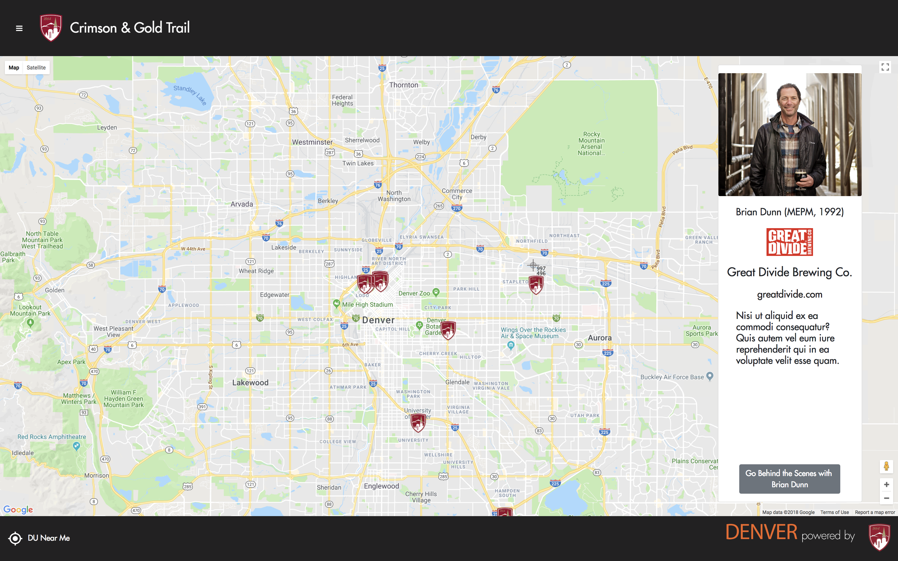

# Crimson & Gold Trail
Demo site for Director of Alumni Engagement at the University of Denver.  Aims to highlight University of Denver alumni and their businesses in the Denver community and by extension the University's impact on the community.

[Deployed Frontend Link](https://crimsonandgoldtrail.firebaseapp.com/)<br>
[Deployed Backend Link](https://crimsonandgoldtrail.herokuapp.com/api/alpha/businesses)<br>
[Server-side Repo](https://github.com/bmj1985/cgtrail-server)<br>

<div>

</div>

## App Description
Basic layout and foundation of an app that highlights Denver business owner alumnus of the University of Denver, their businesses, and their impact on the community.

## Problem Statement
The Director of Alumni Engagement at the University of Denver needed a demo site he could pitch to the marketing team for a proposed project.

## User Experience
Page opens to full screen map with custom University of Denver markers for DU owned businesses throughout the city.  On marker click, a sidebar opens with alumnus portrait, business information, and a button which navigates to a question and answer page further highlighting the business and business owner. There is also a page for tours highlighting businesses in the city, i.e., breweries, restaurants, etc.

## Installation Instructions
Fork, clone the repo, then ```npm install```

## Technologies
* Front-end: ReactJS, reactstrap, Google Maps API, Firebase
* Back-end: Node, Express, Mongoose, MongoDB, Heroku

## Author
Brandon Johnson - Full Stack Web Developer - Denver, Colorado

[GitHub](https://github.com/bmj1985)

[LinkedIn](www.linkedin.com/in/bmj1985/)

## License
MIT
